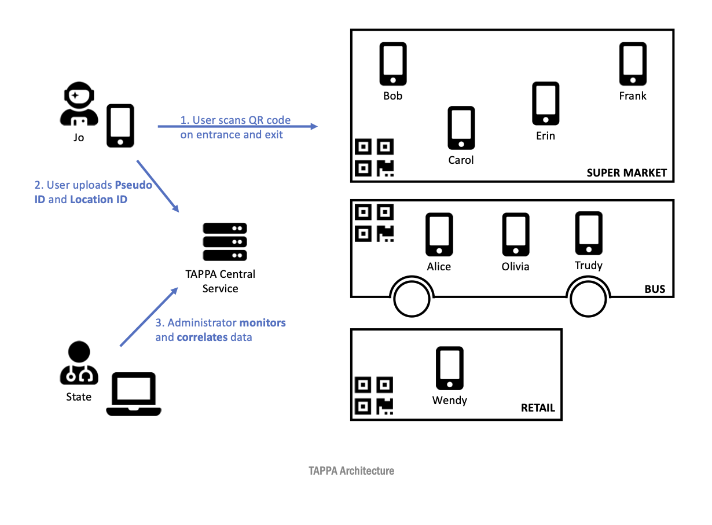

## Tracking A Pandemic, Preserving Anonymity (COVID TAPPA)

## Abstact

**COVID TAPPA** is a system, based on an innovative **TAPPA** architecture, that can be backed and deployed by the state in order to track the exposure and spread of a contagious virus through the general population. The major focus of the system is preserving the privacy and anonymity of the end user and at the same time giving enough information to the state (including geolocation data) that can aid on the monitoring, planning and strategy containing the virus.

## Motivation

* Accurate Disease/Virus Exposure and Spread Tracking along with Targeted Measures can succesfully tackle an epidemic such as COVID-2019 with a minimum impact on society and economy.
* Specifically for COVID-2019 a second wave of infection is expected on Late Fall 2020.
* Propose an architecture to monitor and contain the spread of the virus.

## Solution Characteristics

* Initiative backed up by state.
* Monitor disease/virus spreading.
* Preserve Privacy/Anonymity of the end users.
* Make educated decisions on available resources (population testing, distributing health related equipment etc).
* Build the `TAPPA` System.

## Fundamental Elements

* Each `User` of `TAPPA` (citizen) is assigned with a `Pseudo ID` (PID), **NOT** linked to their Actual Identity.
* Locations that have a higher risk of contamination such as Super Markets, Retail Stores, Buses, Ships and others are allocated with a `Location ID` (LID) that need to meet a certain number of rules (e.g. max capacity per location, max time per end user, hours of operations).
* End user "registers" their `Pseudo ID` with the `Location ID` upon entrance and exit.
* Data that includes `Pseudo IDs` with registered `Location IDs` and `Time Windows` (time spent on the `Location ID`) are sent and stored on a centralized location (`TAPPA Central Service`).

## Concept

* Given that a `User` is tested positive they can optionally send an alert to the `TAPPA Central Service`.
* Upon alerting, `TAPPA Central Service` corelates the data from the `User` and alerts all the other `Users` that are potentially exposed to the disease/virus based on the whether or not they have been on the same `Location ID` for the same `Time Window`.
* The state can take further actions (e.g. disinfecting the `Location ID`, increasing the support on the health facilities in proximity of highly contaminated locations etc).
* The potential contaminated `Users` can proceed with testing or self-quarantine.

## Technology

* `User` operates a `TAPPA mobile app` (iOS/Android) that creates the `Pseudo ID` and "registers" their `Pseudo ID` with the `Location ID`. The use of the app is only required upon entering and exiting a `Location ID`.
* The `Location ID` administrator (e.g. retail store owner) registers with the `TAPPA Central Service` the geolocation of the `Location ID` and downloads a `QR Code` that they place in clear sight on the entrance of the location. The `User` scans the `QR code` upon entry and exit and "registers" their `Pseudo ID` with the `Location ID`.
* The `QR code` can be generated and printed on paper, or can be generated using the same mobile app that the `User` uses running on a different mode (Location Mode).
* Data regarding the registrations of the `Pseudo ID` with `Location IDs` and `Time Windows` are sent by the mobile app to a centralized location (`TAPPA Central Service`) implemented on a cloud based server using a standard Web, Application and Database server model. The mobile app does not have to send the data in real time (mobile data may not be available to all `Users`/`Location IDs`). Instead they can send the data when connected on a WiFi hotspot.
* On the event that a `User` is tested positive to the virus, they can use their mobile app to send their `Pseudo ID` information to the `TAPPA Central Service`.
* `TAPPA Central Service` correlates the data and alerts all possibly contaminated `Users`.
* An `Administration Interface` is used at the `TAPPA Central Service` to administer data and do data analysis.

## FAQ

* *Does the system needs to be mandatory by the state in order to be efficient?* Yes in order to make the system efficient it needs to be implemented by the state. The state will be also the main `Administrator`.
* *What happens for users that do not have a smart phone?* Those users do not participate on the system.
* *What happens for users who do not want to use the mobile app?* The usage of the app is not enforced but instead it relies on the User's social responsibility in order to tackle the transmission of a devastating virus.
* *What happens for users that are tested positive and do not want to report their status using the mobile app?* See previous question.
* *How private are the data transmitted to the `TAPPA Central Service`?* There is absolutely no association between the `Pseudo ID` of the `User` and their actual Identity. Only the Administrator of the `TAPPA Central Service` can have information such as the set of `Pseudo IDs` per `Location IDs` for a given `Time Window`. However even the administrator cannot further track the real Identity of the people that have been in the same `Location ID` at the same time.
* *A malicious user can make a photo of a QR code on a specific location and use it within an online community/group to introduce noise to the system. How do you handle this?* The system relies on the User's social responsibility. However the `QR code` is a simple and fast implementation. The `QR code` can potentially change periodically (not using printed ones). Instead a tablet with the mobile app running in a special `Location ID` mode can be used to generate a `QR code` every few minutes. The `Users` just need to scan the `QR Code` directly from the screen of the device.
* *Can you increase the Privacy and Anonymity by somehow eliminating the use of the `Pseudo IDs`?* We are investigating and exploring different cryptography techniques to further anonymize the data similar to the [Contact Tracing SPEC](https://www.apple.com/covid19/contacttracing) published by Apple and Google.

## Contact

* Nikos Kalogeropoulos nikalog@chemeng.ntua.gr
* Panagiotis Sebos psebos@gmail.com
